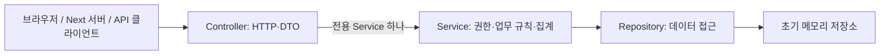

# 카페 백엔드 프로젝트 청사진

작성일 / 개정일: 2026-10-06 (Asia/Seoul)  
문서 개정: v4 — 현재 프런트엔드의 API 호출·DTO·화면 흐름 반영  
기준 문서: [backend-지시서.txt](./backend-지시서.txt)  
연동 기준: [프런트 타입](./frontend/lib/types.ts), [목업 데이터](./frontend/lib/mock.ts), [표기 규칙](./frontend/lib/format.ts), `frontend/app/`의 실제 코드

이 문서는 `backend` 프로젝트의 **REST API 설계와 구현 순서**를 정의한다. 기존 청사진의 JDK 21, Gradle, 최소 Spring MVC 의존성, 3계층, 역할별 폴더와 Controller–Service 1:1 구조를 유지하면서 프런트엔드와 다른 경로·필드·업무 규칙을 수정했다. 현재 작업 공간에는 `backend/` 구현이 없으며, 이 문서의 API와 작업 항목은 구현 계획이다.

## 0. 현재 프런트엔드 확인 결과와 변경 요약

### 실제 호출과 목업 구분

프런트 [README](./frontend/README.md)는 전체를 목업으로 설명하지만, **현재 소스에서는 메뉴 목록의 두 컴포넌트가 백엔드를 실제로 호출한다.** 나머지 화면은 대부분 `lib/mock.ts`의 상수로 렌더링한다. 아래의 ‘실제 호출’은 코드에 요청이 있다는 뜻이며, 백엔드 실행·연동 성공을 확인했다는 뜻은 아니다.

| 화면 / 근거 파일 | 현재 상태 | 백엔드 설계에 반영할 계약 |
| --- | --- | --- |
| [카테고리 필터](./frontend/app/(anon)/menus/_components/CategoryFilter.tsx) | 서버 컴포넌트에서 `http://localhost:8080/api/categories` 호출 | `Category[]` 직접 반환 |
| [공개 메뉴 목록](./frontend/app/(anon)/menus/_components/MenuList.tsx) | `/api/menus` 호출, `category`, `minPrice`, `maxPrice` 전달 | **`MenuSummary[]` 직접 반환**; 현재 `Page` 응답을 읽지 않음 |
| [메뉴 목록 페이지](./frontend/app/(anon)/menus/page.tsx) | URL의 `category`, `price`만 읽음 | 가격 범위를 API의 최소·최대 가격으로 변환; 정렬·검색·페이지 연결은 후속 작업 |
| [홈](./frontend/app/(anon)/page.tsx) | 목업 카테고리·메뉴, 정적 매장 안내 | 좋아요 수 기준 인기 메뉴 4개, 카테고리와 매장 안내 |
| [메뉴 상세](./frontend/app/(anon)/menus/[slug]/page.tsx) | 어느 slug로 접근해도 라떼 목업 표시 | slug 조회, 옵션·영양·안내·개인 좋아요·관련 메뉴 |
| [회원 레이아웃](./frontend/app/my/layout.tsx) 및 주문·좋아요·장바구니 | 고정 `USER`, `ORDERS`, `FAVORITES`, `BASKET` 사용 | 회원 정보, 항목 수 배지, 좋아요, 옵션별 장바구니, 주문 내역 |
| [관리자 대시보드](./frontend/app/admin/page.tsx) 및 메뉴 화면 | 모두 목업; 상세·수정은 항상 라떼 | 대시보드 DTO, ID별 상세·통계·이력, 메뉴 등록·수정·상태 변경 |
| 로그인·회원가입·비밀번호 찾기 | HTML 폼과 안내만 존재; 인증 API 연결 없음 | 초기 local 모의 로그인과 실제 인증의 후속 범위를 구분 |

좋아요·담기·수량 증감·선택 삭제·주문·취소·재주문·관리자 저장 버튼에는 서버 요청 처리가 없다. 정렬 select, 주문 기간 링크와 페이지 링크도 현재 데이터를 실제로 변경하지 않는다. `frontend/README.md`와 타입 주석의 `../backend`, `db/seed.sql`, `com.newlecture.backend` 언급은 과거 설명이며, 현재 작업 공간에서 해당 구현을 확인한 근거로 사용하지 않는다.

### 기존 v3에서 바뀐 설계

| 기존 설계 | v4 적용 내용 | 근거 / 구분 |
| --- | --- | --- |
| `/api/v1`, `/me/cart` | **`/api`, `/my/basket`** | 실제 fetch와 목업의 경로 사용 |
| 공개 상세 `{menuId}` | 공개 상세 `{slug}`, 관리자 상세 `{menuId}` | 공개 링크와 관리자 링크 구분 |
| `name`, `category`, `imageUrl`, `available`, `featured` | `korName`, `engName`, `categoryId`, `imgSrc`, `status`, `isNew`, `favoriteCount` | 프런트 DTO에 맞춤; `isNew`는 추천 여부가 아님 |
| 문자열 카테고리 enum | 숫자 ID를 가진 카테고리와 별도 조회 API | 실제 `category=1` 요청 |
| 모든 목록이 페이지 응답, page=0, `totalElements` | 현재 공개 메뉴는 배열; 페이지 API는 page=1, `total` | 현재 fetch와 `Page<T>`를 각각 반영 |
| 같은 메뉴를 하나로 합산 | 같은 메뉴·온도·사이즈 조합만 합산, 별도 장바구니 항목 ID | `BasketItem`의 필드 구조 |
| 좋아요 없음, 옵션 제외 | 좋아요 CRUD, 온도·사이즈와 추가금 지원 | 회원 화면·메뉴 상세 |
| `CREATED`, `CANCELLED` | `waiting`, `preparing`, `done`, `canceled` | 프런트 상태 타입과 취소 안내 |
| 본문 없는 장바구니 전체 주문만 제공 | 전체 / 선택 주문, 바로 주문, 완료 주문의 장바구니 재담기 | 버튼 의도를 지원하는 **신규 API 설계** |
| 관리자 상세는 메뉴만 반환 | `{menu, stats, history}` | `AdminMenuDetail` |
| 기존 자체 대시보드 필드 | 프런트 `Dashboard` 필드와 집계 정의 | 관리자 카드·최근 주문·순위 |

## 1. 요구사항과 설계 결정

| 항목 | 적용 계획 | 구분 |
| --- | --- | --- |
| 프로젝트명 | `backend` | 지시서 요구 |
| 언어 / JDK | Java / JDK 21 | 지시서 요구 |
| 프레임워크 | Spring Boot **4.1.1** | 개정일에 공식 안정 버전 확인 |
| 빌드 | Gradle Groovy DSL + Wrapper **8.14.4** | Gradle은 요구, DSL·Wrapper 고정은 제안 |
| 패키지 | `com.newcafe.backend` | 원문 패키지의 문법 오류 보정 |
| 아키텍처 | Controller → Service → Repository | 지시서 요구 |
| Controller–Service | Controller마다 전용 Service 하나, 1:1 | 기존 사용자 요구 유지 |
| 역할별 폴더 | `controller/guest`, `controller/member`, `controller/admin`; Service도 동일 | 기존 사용자 요구 유지 |
| 실행 의존성 | `spring-boot-starter-webmvc` 하나 | 최소 웹 라이브러리 요구 |
| 저장소 | Repository 인터페이스 + 메모리 구현체 | DB 미지정에 따른 초기 제안 |
| 응답 기준 | `frontend/lib/types.ts`의 JSON 필드명·타입 | 현재 fetch의 배열 응답은 우선 호환 |
| 회원 식별 | 명시적 `local` 프로필의 모의 로그인 + 서버 세션 | 실제 인증은 후속 범위 |
| 금액 / 집계 시간대 | KRW 정수 원 / `Asia/Seoul` | 서버에서 계산; 응답 시간은 ISO 8601 |

### 패키지명 보정

원문의 `[com.new](http://com.new/)-cafe.backend`는 `com.new-cafe.backend`로 해석했다. Java 패키지에는 `-`를 사용할 수 없고 `new`는 예약어다. 의미를 유지한 유효한 **`com.newcafe.backend`**를 사용한다. 프런트 타입 주석의 `com.newlecture.backend`로 변경하지 않는다.

### 버전과 의존성 근거

- 개정일 기준 공식 안정 버전 목록에서 4.1.1을 확인했다. [Spring Boot 공식 문서](https://docs.spring.io/spring-boot/)
- 4.1.1은 Java 17~26을 지원하며, Gradle 8.x는 8.14 이상 또는 9.x를 지원한다. JDK 21과 Wrapper 8.14.4를 사용한다. [공식 시스템 요구사항](https://docs.spring.io/spring-boot/system-requirements.html), [공식 시작 안내](https://docs.spring.io/spring-boot/tutorial/first-application/)
- MVC·JSON·내장 서버는 `spring-boot-starter-webmvc`와 전이 의존성으로 제공받는다. [공식 웹 시작 안내](https://docs.spring.io/spring-boot/tutorial/first-application/)
- BOM은 Gradle 기본 `platform`으로 적용한다. [공식 의존성 관리 안내](https://docs.spring.io/spring-boot/gradle-plugin/managing-dependencies.html)

JPA, Lombok, JDBC/DB 드라이버, Spring Security, Validation starter, Thymeleaf, Swagger, Actuator, DevTools는 초기 의존성에 추가하지 않는다. 입력 검증은 일반 Java 코드로 수행한다. BOM은 버전 제약이며 실행 라이브러리가 아니다. 테스트 라이브러리는 기본안에 포함하지 않고 우선 HTTP 시나리오로 검증한다.

## 2. 기능 범위와 단계 구분

### 초기 백엔드 구현

| 사용자 | 기능 | 초기 구현 내용 |
| --- | --- | --- |
| 모든 사용자 | 카테고리·메뉴 조회 | 카테고리 개수, 공개 목록·slug 상세, 카테고리·가격·이름 검색·정렬·페이지 확장 조회 |
| 모든 사용자 | 랜딩 데이터 | 소개·운영시간·주소·연락처·카테고리·좋아요 기준 인기 메뉴 |
| 회원 | 회원 정보·대시보드 | 현재 회원, 주문·좋아요·장바구니 항목 수와 최근 주문 |
| 회원 | 좋아요 | 목록, 중복 없는 등록·취소, 메뉴별 좋아요 수 |
| 회원 | 장바구니 | 옵션 선택·기본 옵션 담기, 조회·합산·수량 변경·항목 삭제·전체 비우기 |
| 회원 | 주문 | 전체·선택 장바구니 주문, 바로 주문, 본인 목록·상세·대기 주문 취소, 완료 주문 재담기 |
| 관리자 | 메뉴 관리 | 등록·목록·상세·부분 수정·판매 상태 변경·논리 삭제·통계·변경 이력 |
| 관리자 | 주문 상태 진행 | `waiting → preparing → done` API; **현재 관리자 화면에는 없는 신규 백엔드 설계** |
| 관리자 | 대시보드 | 당일 주문금액·제조 중 주문·신규 회원·메뉴 상태 수·최근 주문·주문 수량 순위 |

관리자 주문 상태 API는 프런트가 사용하는 제조 중·수령 완료 상태를 실제로 진행시키기 위한 계획이다. 관리자 내비의 ‘주문 관리’·‘회원 관리’ 링크가 별도 CRUD 화면의 구현 근거는 아니다. 초기 범위에 회원 관리 CRUD를 추가하지 않는다.

### 화면은 있지만 후속 개발로 두는 기능

| 기능 | 현재 화면 | 초기 동작 / 후속 결정 |
| --- | --- | --- |
| 실제 인증 | 로그인, 회원가입, 중복 확인, 이메일 인증, 비밀번호 찾기, 소셜 버튼, 로그인 유지 | local 모의 로그인만 제공; 실제 인증은 저장소·비밀번호 보관·메일·세션 정책과 함께 별도 설계 |
| 쿠폰 | `WELCOME`, 고정 할인 1,000원 표시 | 초기 `discount=0`, `couponCode=null`; 쿠폰 입력을 받지 않는다. 견적·유효기간·사용 제한·최소 금액은 후속 결정 |
| 수령 방식 | `pickup=store` / `takeout` | 초기 매장 픽업만 지원; 테이크아웃 선택 저장은 DTO·요청 확장 후 연동 |
| 이미지 업로드 | PNG/JPG, 최대 5MB 안내와 파일 input | 초기 URL 문자열만 저장; multipart 업로드·파일 저장·삭제는 12절의 후속 계획 |
| 영양·상세 이미지·안내 편집 | 상세 DTO에는 존재, 현재 등록 폼에는 입력 없음 | 초기 시드·관리 JSON 요청으로 설정 가능; 편집 UI 확장은 후속 작업 |
| 결제·환불·배송·재고·알림 | 구체적 연동 없음 | 초기 범위 제외 |

고정 쿠폰 할인과 ‘총 결제 금액’ 문구는 결제 기능의 구현 증거가 아니다. 초기 연동 시 프런트는 할인 상수 대신 서버 금액을 표시하고, 지원되지 않는 쿠폰·테이크아웃·업로드 조작을 비활성화해야 한다. ‘30분 이내 수령’은 안내이며 자동 취소·수령 제한 타이머를 의미하지 않는다.

산출물은 JSON API와 요청·응답 명세다. 화면·HTML/CSS·템플릿 렌더링은 백엔드 범위에 포함하지 않는다. 이번 문서 개정에서 프런트 파일을 수정하지 않는다.

## 3. 3계층 아키텍처와 1:1 역할 구조



| 계층 | 책임 | 구현 규칙 |
| --- | --- | --- |
| Controller | 경로·JSON·HTTP 상태, 현재 사용자 해석 | 대응하는 전용 Service 하나만 호출; Repository 직접 접근 금지 |
| Service | 소유권·메뉴/옵션 검증, 가격·주문·집계 | HTTP 객체에 의존하지 않음; 다른 Service 호출 금지 |
| Repository | 저장·조회·검색에 필요한 접근 | HTTP와 가격·권한 정책을 넣지 않음; 여러 Service에서 공유 가능 |

- 생성자 주입을 사용하며 Lombok 없이 직접 작성한다.
- Service는 구현 클래스 하나로 시작하고 불필요한 인터페이스를 만들지 않는다.
- Repository는 인터페이스와 `InMemory...Repository`로 나누어 이후 DB 구현체로 교체한다.
- DTO는 Java `record`, 도메인은 일반 Java 클래스 또는 불변 `record`를 사용한다. JPA 어노테이션은 사용하지 않는다.
- 가격·옵션·스냅샷 생성의 공통 규칙은 도메인 메서드 또는 순수 Java 객체로 재사용한다. 공유 업무 Service를 추가하지 않는다.
- `domain`, `dto`, `common`, `config`는 위 계층을 지원한다. Advice·Interceptor는 업무 Controller–Service 쌍에 포함하지 않는다.

### Controller–Service 대응표

`guest`는 회원·관리자도 접근 가능한 공개 API 패키지다. 예약어 `public`은 패키지명으로 사용하지 않는다. `member` API는 로그인한 회원·관리자, `admin` API는 관리자만 접근한다. **Controller 12개와 전용 Service 12개**를 아래처럼 대응시킨다.

모든 Java 경로는 `backend/src/main/java/com/newcafe/backend/` 기준이다.

| 역할 | Controller 파일 | 전용 Service 파일 | 담당 경로 |
| --- | --- | --- | --- |
| 공개 | `controller/guest/GuestCategoryController.java` | `service/guest/GuestCategoryService.java` | `/api/categories` |
| 공개 | `controller/guest/GuestMenuController.java` | `service/guest/GuestMenuService.java` | `/api/menus`, `/api/menus/page`, `/api/menus/{slug}` |
| 공개 | `controller/guest/GuestLandingController.java` | `service/guest/GuestLandingService.java` | `/api/landing` |
| local 전용 | `controller/guest/DevAuthController.java` | `service/guest/DevAuthService.java` | `/api/dev/login`, `/api/dev/logout` |
| 회원 | `controller/member/MemberProfileController.java` | `service/member/MemberProfileService.java` | `/api/my/profile` |
| 회원 | `controller/member/MemberFavoriteController.java` | `service/member/MemberFavoriteService.java` | `/api/my/favorites/**` |
| 회원 | `controller/member/MemberBasketController.java` | `service/member/MemberBasketService.java` | `/api/my/basket/**` |
| 회원 | `controller/member/MemberOrderController.java` | `service/member/MemberOrderService.java` | `/api/my/orders/**` |
| 회원 | `controller/member/MemberDashboardController.java` | `service/member/MemberDashboardService.java` | `/api/my/dashboard` |
| 관리자 | `controller/admin/AdminMenuController.java` | `service/admin/AdminMenuService.java` | `/api/admin/menus/**` |
| 관리자 | `controller/admin/AdminOrderController.java` | `service/admin/AdminOrderService.java` | `/api/admin/orders/**` |
| 관리자 | `controller/admin/AdminDashboardController.java` | `service/admin/AdminDashboardService.java` | `/api/admin/dashboard` |

`DevAuthService`는 데모 사용자 조회·검증을 담당한다. HTTP 세션 생성·ID 갱신·무효화는 `DevAuthController`가 담당한다. 두 클래스는 모두 `local` 프로필 전용으로 등록한다.

### 디렉터리 구조

```text
ncafe/
├── backend-지시서.txt
├── backend-청사진.md
├── frontend/                       현재 프런트엔드
└── backend/                        아래는 생성 예정 구조
    ├── settings.gradle
    ├── build.gradle
    ├── gradlew / gradlew.bat
    ├── gradle/wrapper/
    ├── README.md
    └── src/main/
        ├── java/com/newcafe/backend/
        │   ├── BackendApplication.java
        │   ├── controller/
        │   │   ├── guest/
        │   │   │   ├── GuestCategoryController.java
        │   │   │   ├── GuestMenuController.java
        │   │   │   ├── GuestLandingController.java
        │   │   │   └── DevAuthController.java
        │   │   ├── member/
        │   │   │   ├── MemberProfileController.java
        │   │   │   ├── MemberFavoriteController.java
        │   │   │   ├── MemberBasketController.java
        │   │   │   ├── MemberOrderController.java
        │   │   │   └── MemberDashboardController.java
        │   │   └── admin/
        │   │       ├── AdminMenuController.java
        │   │       ├── AdminOrderController.java
        │   │       └── AdminDashboardController.java
        │   ├── service/
        │   │   ├── guest/          위 공개 Controller에 대응하는 Service 4개
        │   │   ├── member/         위 회원 Controller에 대응하는 Service 5개
        │   │   └── admin/          위 관리자 Controller에 대응하는 Service 3개
        │   ├── repository/
        │   │   ├── CategoryRepository.java
        │   │   ├── MenuRepository.java
        │   │   ├── MemberRepository.java
        │   │   ├── FavoriteRepository.java
        │   │   ├── BasketRepository.java
        │   │   ├── OrderRepository.java
        │   │   ├── MenuHistoryRepository.java
        │   │   └── memory/         구현체와 공유 저장소·lock
        │   ├── domain/            Category, Menu, MenuOption, Nutrition,
        │   │                      Member, Favorite, Basket, BasketItem,
        │   │                      Order, OrderItem, MenuHistory
        │   ├── dto/               category, menu, member, favorite,
        │   │                      basket, order, dashboard, auth
        │   ├── common/
        │   │   ├── exception/
        │   │   ├── response/
        │   │   └── auth/           현재 사용자 해석·권한 Interceptor
        │   └── config/
        │       ├── WebConfig.java
        │       ├── TimeConfig.java
        │       └── DevDataInitializer.java
        └── resources/
            ├── application.properties
            └── application-local.properties
```

위 표의 Service 파일명을 그대로 사용한다. 예를 들어 `AdminMenuController`에는 `AdminMenuService`만 주입한다.

```java
package com.newcafe.backend.controller.admin;

import com.newcafe.backend.service.admin.AdminMenuService;
import org.springframework.web.bind.annotation.RequestMapping;
import org.springframework.web.bind.annotation.RestController;

@RestController
@RequestMapping("/api/admin/menus")
public class AdminMenuController {
    private final AdminMenuService adminMenuService;

    public AdminMenuController(AdminMenuService adminMenuService) {
        this.adminMenuService = adminMenuService;
    }
    // 각 메뉴 관리 API는 adminMenuService를 호출한다.
}
```

공개·관리자 Controller에 공용 `MenuService`를 주입하거나 회원·관리자 대시보드에 공용 `DashboardService`를 주입하는 구조는 사용하지 않는다.

## 4. 최소 Gradle 구성과 실행 설정

`settings.gradle`:

```groovy
rootProject.name = 'backend'
```

`build.gradle`:

```groovy
plugins {
    id 'java'
    id 'org.springframework.boot' version '4.1.1'
}

group = 'com.newcafe'
version = '0.0.1-SNAPSHOT'

java {
    toolchain {
        languageVersion = JavaLanguageVersion.of(21)
    }
}

repositories {
    mavenCentral()
}

dependencies {
    implementation platform(
        org.springframework.boot.gradle.plugin.SpringBootPlugin.BOM_COORDINATES
    )
    implementation 'org.springframework.boot:spring-boot-starter-webmvc'
}
```

기본 설정은 `spring.application.name=backend`, `server.port=8080`이다. 개발 실행은 `./gradlew bootRun --args='--spring.profiles.active=local'`로 프로필을 명시한다. 기본 프로필에서는 개발 로그인과 데모 데이터를 활성화하지 않는다.

프런트 개발 주소는 `http://localhost:3000`이다. 현재 공개 조회는 Next 서버에서 `http://localhost:8080`으로 호출한다. 브라우저에서 백엔드를 직접 호출할 때만 해당 origin의 CORS·세션 쿠키 설정이 필요하며 서버 간 fetch에는 브라우저 CORS가 적용되지 않는다. 프런트의 `allowedDevOrigins`는 백엔드 CORS 설정을 대신하지 않는다.

## 5. 데이터 모델과 프런트 DTO 계약

### 내부 데이터 모델

| 모델 | 주요 필드 | 정책 |
| --- | --- | --- |
| Category | `id`, `name`, `displayOrder` | 초기 4개 고정; 응답의 `count`는 메뉴에서 집계 |
| Menu | `id`, `slug`, `korName`, `engName`, `categoryId`, `price`, `description`, `detail`, `imgSrc`, `images`, `status`, `isNew`, `options`, `nutrition`, `notices`, `deleted`, `createdAt`, `updatedAt` | 비공개·품절·논리 삭제를 구분 |
| MenuOption | `kind`, `name`, `extraPrice`, `isDefault` | 온도·사이즈 그룹, 메뉴 내 `(kind, name)` 유일 |
| Nutrition | `kcal`, `sodiumMg`, `sugarG`, `satFatG`, `proteinG`, `caffeineMg` | 각 값과 Nutrition 자체 모두 nullable |
| Member | `id`, `username`, `name`, `email`, `role`, `createdAt` | 초기 데모 사용자; 회원 생성 시각은 집계에 필요 |
| Favorite | `memberId`, `menuId`, `createdAt` | `(memberId, menuId)` 유일 |
| Basket | `memberId`, `items`, `updatedAt` | 회원당 하나 |
| BasketItem | `id`, `menuId`, `temperature`, `size`, `quantity`, `lastUnitPrice` | 메뉴·옵션 조합별 항목; 마지막 단가는 옵션 제거 후 표시용 |
| Order | `id`, `orderNo`, `memberId`, `customerName`, `status`, `items`, `itemTotal`, `discount`, `total`, `couponCode`, `createdAt`, `updatedAt`, `cancelledAt` | 회원·메뉴·가격 스냅샷; 초기 할인 없음 |
| OrderItem | `menuId`, `slug`, `menuName`, `imgSrc`, `temperature`, `size`, `quantity`, `unitPrice`, `price` | 주문 당시 값의 불변 스냅샷 |
| MenuHistory | `id`, `menuId`, `content`, `actorId`, `actorName`, `createdAt` | 등록·변경·삭제 이력; actor는 서버 세션에서 결정 |

내부 enum을 대문자로 정의하더라도 **JSON의 role·status·kind는 프런트와 같은 소문자 문자열**로 직렬화한다. `deleted`, 회원 ID, 이력 actor ID 등 내부 필드를 공개 DTO에 그대로 노출하지 않는다.

- 식별자는 서버에서 `AtomicLong`으로 발급한다. Java에서는 `Long`, JSON에서는 숫자이며 프런트의 안전한 정수 범위 안에서 사용한다. 클라이언트가 ID를 발급하지 않는다.
- 금액은 KRW 정수 원 단위 `long`이다. 음수·오버플로·JSON 안전 정수 범위를 검증한다. 영양 수치는 소수 입력이 가능하며 금액 계산과 분리한다.
- 시간은 `Instant`로 저장하고 ISO 8601 UTC로 반환한다. 집계·날짜 필터에는 주입한 `Clock`과 `Asia/Seoul`을 사용한다.
- Repository는 가변 내부 컬렉션 대신 불변 복사본을 반환한다.

### 외부 응답 DTO

필드명과 구조는 [frontend/lib/types.ts](./frontend/lib/types.ts)를 따른다. Java DTO 이름에 `Response` 등을 붙일 수 있지만 JSON 이름을 임의로 바꾸지 않는다.

| 프런트 타입 | JSON 필드 / 구조 |
| --- | --- |
| `Member` | `id`, `username`, `name`, `email`, `role: "member" \| "admin"` |
| `Category` | `id`, `name`, `count` |
| `MenuSummary` | `id`, `slug`, `korName`, `engName`, `price`, `categoryId`, `categoryName`, `status`, `isNew`, `imgSrc`, `favoriteCount`, `createdAt` |
| `MenuDetail` | MenuSummary의 **최상위 필드** + `description`, `detail`, `images`, `options`, `nutrition`, `notices`, `favorite`, `related`, `updatedAt` |
| `MenuOption` | `kind: "temperature" \| "size"`, `name`, `extraPrice`, `isDefault` |
| `Nutrition` | `kcal`, `sodiumMg`, `sugarG`, `satFatG`, `proteinG`, `caffeineMg`; 각 값은 number 또는 null |
| `Page<T>` | `items`, `page`, `size`, **`total`**, `totalPages`; page는 **1부터** |
| `Favorite` | `menu: MenuSummary`, `createdAt` |
| `BasketItem` | `id`, `menuId`, `slug`, `korName`, `imgSrc`, `temperature`, `size`, `unitPrice`, `quantity`, `price`, `orderable` |
| `Basket` | `items: BasketItem[]`, `itemTotal` |
| `OrderItem` | `menuId`, `slug`, `menuName`, `imgSrc`, `temperature`, `size`, `quantity`, `unitPrice`, `price` |
| `Order` | `id`, `orderNo`, `status`, `itemTotal`, `discount`, `total`, `couponCode`, `items`, `createdAt` |
| `MenuHistory` | `content`, `actor: string \| null`, `createdAt` |
| `AdminMenuDetail` | `menu: MenuDetail`, `stats: {orderCount, weekOrderCount, favoriteCount, basketCount}`, `history: MenuHistory[]` |
| `Dashboard` | `todayOrders`, `todaySales`, `preparing`, `newMembersThisWeek`, `menusOn`, `menusSoldout`, `menusHidden`, `recentOrders`, `ranks` |

`imgSrc`, `temperature`, `size`, `couponCode`는 해당 프런트 타입에 맞춰 null을 허용한다. 컬렉션은 없을 때 `[]`, 설명 문자열은 없을 때 `""`로 반환한다. `MenuDetail.nutrition`은 전체가 null일 수 있다. `related`는 MenuSummary 배열이며 MenuDetail을 재귀적으로 넣지 않는다.

`Dashboard.recentOrders`의 항목은 `{orderNo, customer, summary, total, status, createdAt}`, `ranks`의 항목은 `{menuId, name, count, ratio}`다. 관리자 상세의 `menu.favorite`는 false로 반환한다.

### 프런트 타입에 아직 없는 신규 응답

아래 DTO는 기존 화면과 원문 요구를 지원하는 **설계 제안**이며 현재 `lib/types.ts`에 정의되어 있지 않다. 실제 연동 시 프런트 타입을 추가한다.

- `Landing`: `{cafeName, introduction, businessHours, address, contact, categories, popularMenus}`. businessHours와 address는 문자열 배열, contact는 `{phone, email}`, categories는 Category 배열, popularMenus는 MenuSummary 배열이다.
- `MemberDashboard`: `{counts: {orders, favorites, basket}, basketQuantity, activeOrderCount, activeOrderAmount, recentOrders}`. recentOrders는 Order 배열이다. 회원 대시보드 화면은 현재 별도 페이지가 없으므로 `/my` 헤더·탭의 집계부터 공급한다.

### 메모리 저장소와 원자성

초기 구현은 단일 프로세스이며 재시작하면 데이터가 초기화된다. 영구 보관·여러 서버 간 공유·DB 트랜잭션은 제공하지 않는다. DB 선택은 후속 작업이다.

`ConcurrentHashMap`만으로 Repository 간 주문 처리를 원자적으로 만들 수 없다. 메뉴·옵션·좋아요·장바구니·주문·이력 변경과 일관된 집계 읽기는 공유 저장소의 **같은 lock**을 사용한다. 모든 검증·금액 계산·새 객체 생성을 끝낸 뒤 변경을 반영하고, 중간 실패 시 이전 상태를 복구하는 경계를 정의한다. 주문 저장과 선택 장바구니 항목 제거, 메뉴 변경과 이력 추가는 각각 같은 원자적 범위에서 처리한다.

## 6. API 계약

공통 prefix는 **`/api`**다. 기존 청사진의 `/api/v1`, `/me`, `/cart` 대신 프런트의 경로를 채택하며 초기에는 중복 별칭을 만들지 않는다. 아래 표의 경로는 `/api` 뒤에 붙인다. `my`는 세션의 현재 사용자이며 임의의 `memberId`를 받지 않는다.

‘공개’는 비회원 포함, ‘회원’은 로그인한 member/admin, ‘관리자’는 admin 전용이다. 현재 실제 호출이 있는 것은 `/categories`, `/menus`뿐이다. 나머지는 프런트 목업의 목표 경로 또는 신규 설계다.

### 공개·개발용 API

| 기능 | Method | 경로 | 권한 | 성공 응답 |
| --- | --- | --- | --- | --- |
| 카테고리 목록 | GET | `/categories` | 공개 | 200, `Category[]` |
| 공개 메뉴 전체 목록 | GET | `/menus` | 공개 | 200, **`MenuSummary[]`** |
| 공개 메뉴 페이지 조회 | GET | `/menus/page` | 공개 | 200, `Page<MenuSummary>`; 신규 확장 경로 |
| 공개 메뉴 상세 | GET | `/menus/{slug}` | 공개 | 200, `MenuDetail` |
| 랜딩 데이터 | GET | `/landing` | 공개 | 200, `Landing` |
| 개발 로그인 | POST | `/dev/login` | local 전용 | 200, `Member` + 세션 쿠키 |
| 개발 로그아웃 | POST | `/dev/logout` | local 전용 | 204 |

### 회원 API

| 기능 | Method | 경로 | 권한 | 성공 응답 |
| --- | --- | --- | --- | --- |
| 본인 정보 | GET | `/my/profile` | 회원 | 200, `Member` |
| 좋아요 목록 | GET | `/my/favorites` | 회원 | 200, `Favorite[]` |
| 좋아요 등록 | PUT | `/my/favorites/{menuId}` | 회원 | 204; 중복 등록도 동일 |
| 좋아요 취소 | DELETE | `/my/favorites/{menuId}` | 회원 | 204; 이미 취소했어도 동일 |
| 장바구니 조회 | GET | `/my/basket` | 회원 | 200, `Basket` |
| 옵션별 메뉴 담기 | POST | `/my/basket/items` | 회원 | 200, 변경 `Basket` |
| 항목 수량 지정 | PATCH | `/my/basket/items/{basketItemId}` | 회원 | 200, 변경 `Basket` |
| 항목 삭제 | DELETE | `/my/basket/items/{basketItemId}` | 회원 | 204 |
| 전체 비우기 | DELETE | `/my/basket/items` | 회원 | 204 |
| 전체 / 선택 장바구니 주문 | POST | `/my/orders` | 회원 | 201, `Order` + Location |
| 메뉴 상세에서 바로 주문 | POST | `/my/orders/direct` | 회원 | 201, `Order` + Location; 신규 설계 |
| 본인 주문 목록 | GET | `/my/orders` | 회원 | 200, **`Page<Order>`**; 프런트 `.items` 연동 필요 |
| 본인 주문 상세 | GET | `/my/orders/{orderId}` | 회원 | 200, `Order` |
| 대기 주문 취소 | POST | `/my/orders/{orderId}/cancel` | 회원 | 200, 변경 `Order` |
| 완료 주문 재담기 | POST | `/my/orders/{orderId}/reorder` | 회원 | 200, 변경 `Basket`; 신규 설계 |
| 회원 대시보드 | GET | `/my/dashboard` | 회원 | 200, `MemberDashboard` |

### 관리자 API

| 기능 | Method | 경로 | 권한 | 성공 응답 |
| --- | --- | --- | --- | --- |
| 메뉴 목록 | GET | `/admin/menus` | 관리자 | 200, `Page<MenuSummary>` |
| 메뉴 상세 | GET | `/admin/menus/{menuId}` | 관리자 | 200, `AdminMenuDetail` |
| 메뉴 등록 | POST | `/admin/menus` | 관리자 | 201, `AdminMenuDetail` + Location |
| 메뉴 부분 수정·상태 변경 | PATCH | `/admin/menus/{menuId}` | 관리자 | 200, 변경 `AdminMenuDetail` |
| 메뉴 논리 삭제 | DELETE | `/admin/menus/{menuId}` | 관리자 | 204 |
| 주문 목록 | GET | `/admin/orders` | 관리자 | 200, `Page<Order>`; 신규 설계 |
| 주문 상태 진행 | PATCH | `/admin/orders/{orderId}/status` | 관리자 | 200, 변경 `Order`; 신규 설계 |
| 관리자 대시보드 | GET | `/admin/dashboard` | 관리자 | 200, `Dashboard` |

선택 좋아요 삭제·선택 장바구니 담기·선택 장바구니 삭제·관리자 선택 비공개·선택 메뉴 삭제는 초기에는 해당 **단건 API를 순서대로 호출**한다. 묶음 전체의 원자성을 보장하지 않으며 성공한 항목과 실패 항목을 각각 표시·재조회하는 프런트 연동이 필요하다. 선택 **주문**은 `/my/orders` 한 요청 안에서 전체 성공 또는 전체 실패로 처리한다.

### 조회·페이지 규칙

| API | 입력 | 기본값 / 규칙 |
| --- | --- | --- |
| `/menus`, `/menus/page` | `category`, `minPrice`, `maxPrice`, `name`, `sort` | category는 양의 숫자 ID; price 범위는 양 끝 포함; 이름은 한글·영문 부분 검색 |
| 공개 메뉴 정렬 | `popular`, `latest`, `priceAsc`, `priceDesc` | 기본 popular는 favoriteCount 내림차순; latest는 createdAt 내림차순, 가격순은 기본 가격 기준, 동률은 ID 내림차순 |
| `/menus/page` | `page`, `size` | page=1, size=12; size는 1~100 |
| `/admin/menus` | `category`, `status`, `name`, `page`, `size` | 비공개 포함·삭제 제외; 기본 ID 내림차순, page=1, size=10 |
| `/my/orders` | `months`, `from`, `to`, `page`, `size` | 최신 생성순·동률 ID 내림차순, page=1, size=10; 기간은 7절 참조 |
| `/admin/orders` | `status`, `from`, `to`, `page`, `size` | 기간 미지정은 전체; 정렬·페이지는 회원 주문과 동일 |

- `/menus`는 현재 컴포넌트에 맞춰 전체 **배열**만 반환한다. page, size를 보내면 400으로 안내하고 페이지 조회는 `/menus/page`를 사용한다. 같은 URL이 파라미터에 따라 배열/객체로 바뀌지 않게 한다.
- `/menus/page`는 기존의 공개 페이지 조회 요구를 유지하기 위한 새 경로다. 현재 프런트에는 호출이 없으며 향후 MenuList를 이 경로와 `.items`, `total`, Pager로 전환한다.
- 페이지 수는 `ceil(total / size)`이며 결과가 없으면 `totalPages=0`, `items=[]`다. 범위보다 큰 양의 page는 빈 items를 반환한다. page≤0·size 범위 밖은 400이다.
- minPrice, maxPrice는 0 이상 정수이며 min>max는 400이다. `0-5000`, `5000-7000` 화면 구간은 5,000원을 공유한다. 프런트의 구간 안내를 그대로 따른다.
- category 숫자 형식이 틀리면 400, 유효한 형식이지만 없는 카테고리 ID면 404다. 미지원 sort/status, 유효하지 않은 날짜는 400이다.
- 공개 조회는 hidden·삭제 메뉴를 제외하고 soldout은 포함한다. 공개 숨김·삭제 메뉴 상세는 404다. 관리자만 숨김 메뉴 상세를 조회한다.
- name 검색·sort·page는 백엔드 계획에 포함하지만 현재 공개 프런트는 이를 전달하지 않는다. 기존 문서의 keyword 별칭은 만들지 않는다.

### 요청 예시

메뉴 등록: 프런트 `MenuForm` 타입의 JSON 구조를 기준으로 한다. slug 생략 시 서버에서 생성하며, 선택 상세 필드의 기본값은 7절을 따른다.

```json
{
  "slug": "latte",
  "categoryId": 1,
  "korName": "카페라떼",
  "engName": "Caffe Latte",
  "price": 4500,
  "description": "에스프레소와 부드러운 우유",
  "detail": "## 메뉴 소개\n부드러운 우유를 더한 카페라떼입니다.",
  "status": "on",
  "isNew": false,
  "options": [
    {"kind": "temperature", "name": "HOT", "extraPrice": 0, "isDefault": true},
    {"kind": "temperature", "name": "ICE", "extraPrice": 0, "isDefault": false},
    {"kind": "size", "name": "Regular", "extraPrice": 0, "isDefault": true},
    {"kind": "size", "name": "Large", "extraPrice": 500, "isDefault": false}
  ],
  "notices": ["제조 시작 이후에는 주문 취소가 불가능합니다."]
}
```

imgSrc, images, nutrition은 위 폼 타입에 없는 관리자 요청의 선택 확장 필드로 허용한다. 서버 발급 id, favoriteCount, createdAt, stats, history, actor는 입력받지 않는다.

장바구니 담기 / 바로 주문은 같은 입력 필드를 사용한다.

```json
{"menuId": 23, "temperature": "HOT", "size": "Large", "quantity": 2}
```

기본 옵션 담기: `{"menuId":23,"quantity":1}`.  
수량 지정: `{"quantity":3}`.  
전체 장바구니 주문: 본문 생략 또는 `{}`.  
선택 주문: `{"basketItemIds":[1,2]}`.  
메뉴 비공개: `{"status":"hidden"}`.  
제조 시작: `{"status":"preparing"}`.  
개발 로그인: `{"memberId":2}`; **이 memberId 입력은 local 데모 계정 선택에만 사용한다.**

### 응답·오류 형식과 PATCH

성공 응답에 data 등의 공통 래퍼를 추가하지 않는다. 단건은 DTO, 배열은 배열, 페이지는 아래 구조를 직접 반환한다. 201의 Location은 생성된 상세 API 경로이며, 204는 본문이 없다.

```json
{"items": [], "page": 1, "size": 12, "total": 0, "totalPages": 0}
```

오류는 `@RestControllerAdvice`와 공통 HTTP 처리에서 아래 형식으로 통일한다.

```json
{
  "code": "MENU_NOT_ORDERABLE",
  "message": "현재 주문할 수 없는 메뉴가 포함되어 있습니다.",
  "path": "/api/my/orders",
  "timestamp": "2026-10-06T00:00:00Z"
}
```

| 상태 | 사례 |
| --- | --- |
| 400 | 잘못된 JSON·입력·페이지·옵션, 빈 장바구니 / 빈 선택 주문, 미지원 필드 |
| 401 | 보호 API에 유효한 로그인 세션 없음 |
| 403 | 관리자 API에 일반 회원 접근 |
| 404 | 메뉴·카테고리·장바구니 항목·주문 없음; 다른 회원의 항목·주문 접근 |
| 409 | slug 중복, 담기·주문 시 품절·숨김·삭제, 주문 시 옵션 제거, 허용되지 않는 주문 상태 변경 |
| 500 | 예상하지 못한 내부 오류; 상세 구현 정보는 응답에서 제외 |

PATCH는 허용 필드만 변경한다. 생략한 필드는 유지하며 배열을 보낸 경우 해당 배열 전체를 교체한다. imgSrc, nutrition은 null로 지울 수 있고, 나머지 필드의 명시적 null은 400이다. 문자열 삭제는 `""`, 목록 삭제는 `[]`를 사용한다. 빈 PATCH, 잘못된 타입, DTO에 정의되지 않은 필드는 400이다. 이미지 URL을 서버가 대신 다운로드하지 않는다.

## 7. 업무 규칙

### 메뉴·카테고리·상세

- 초기 카테고리는 `1=커피`, `2=티`, `3=에이드 · 스무디`, `4=디저트`다. 카테고리 CRUD는 초기 범위에서 제외한다. count는 hidden·삭제를 제외한 메뉴 수이며 품절은 포함한다. 필터 적용 여부와 관계없이 카테고리 전체 공개 개수를 반환한다.
- korName, engName은 trim 후 각각 1~100자, description은 최대 1,000자, detail은 최대 20,000자의 문자열로 제안한다. 가격은 1원 이상 정수다. 현재 폼의 `min=0`, `step=100`은 서버 정책을 대신하지 않으며 초기 연동 시 최소값 안내를 맞춘다.
- slug는 영문 소문자·숫자·하이픈 1~100자로 유일하게 관리한다. `/menus/page`와 충돌하는 page는 예약 값이다. 생략 시 영문명에서 생성하고 빈 값/충돌이면 서버 ID 접미사로 유일하게 만든다. 수정 시 명시적으로 바꾸지 않는 한 기존 slug를 유지한다.
- 등록 기본값은 `status=on`, `isNew=false`, `deleted=false`, `imgSrc=null`, `images=[]`, `options=[]`, `nutrition=null`, `notices=[]`, 설명 문자열은 `""`다. 가격·이름·카테고리는 필수다.
- on은 조회·담기·주문 가능, soldout은 공개 조회 가능하지만 담기·주문 불가, hidden은 공개 조회·담기·주문 불가다. deleted는 모든 활성 목록과 신규 주문에서 제외한다.
- 이미지 URL은 HTTPS URL 또는 서비스가 제공하는 `/images/...` 경로 문자열로 제한한다. 프런트의 `/images/menus/{slug}.svg`는 프런트 호스트의 자산 경로이며 업로드 저장소가 아니다. 새 slug에 기본 SVG가 없을 수 있으므로 프런트에 일반 대체 이미지 처리가 필요하다.
- detail은 마크다운 문자열로 저장한다. 현재 공개 상세는 일반 텍스트로 표시하므로 마크다운 렌더링은 프런트 후속 작업이며 raw HTML 허용 정책을 별도로 정한다.
- 각 옵션 그룹의 `(kind,name)`은 중복될 수 없고, 제공하는 그룹에는 기본 옵션이 정확히 하나 있어야 한다. 추가금은 0 이상 정수다. 제공하지 않는 그룹은 빈 목록이며 장바구니 선택값은 null이다.
- 관련 메뉴는 같은 카테고리의 다른 공개·미삭제 메뉴를 createdAt 내림차순·ID 내림차순으로 최대 4개 반환한다. 품절 메뉴는 표시 가능하다.
- 메뉴 등록·실제 필드 변경·논리 삭제 때 이력을 남긴다. actor 이름·시각은 서버에서 정하고 같은 값의 PATCH에는 불필요한 이력을 추가하지 않는다.

### 좋아요

- 등록은 공개·미삭제 메뉴에만 허용한다. 품절 메뉴에도 좋아요를 할 수 있다. 같은 회원의 반복 PUT은 수와 등록 시각을 바꾸지 않는다.
- 삭제는 본인의 관계만 제거하며 없는 관계도 204다. 최신 등록시각 내림차순·동률 메뉴 ID 내림차순으로 조회한다.
- 초기 정책은 숨김·삭제 메뉴를 좋아요 응답에서 제외하되 관계는 보관한다. 다시 공개하면 기존 좋아요가 재노출된다. 회원 배지도 같은 조회 가능한 좋아요 개수로 계산한다.
- favoriteCount는 메뉴에 등록된 회원 관계의 개수다. 공개 상세의 favorite는 현재 회원의 관계 여부이고 비회원은 false다. 회원별 응답은 공용 캐시에 섞이지 않게 한다.
- 목록·좋아요 화면에서 옵션 없이 담으면 메뉴의 기본 옵션으로 수량 1을 담는다. 품절·숨김·삭제는 서버에서 다시 거절한다.

### 장바구니

- 항목별 수량은 1~100이다. 동일 `(memberId, menuId, temperature, size)` 조합은 수량을 합산하고 다른 옵션 조합은 다른 `BasketItem.id`를 갖는다. 합산 후에도 수량 제한을 검사한다.
- 담기에서 선택을 생략하면 제공 그룹의 기본 옵션을 사용한다. 그룹이 없으면 생략 또는 null만 허용한다. 그룹이 있는데 null·빈 문자열·존재하지 않는 옵션명을 지정하면 400이다.
- `unitPrice = 현재 메뉴 가격 + 선택 옵션 추가금`, `price = unitPrice × quantity`, `itemTotal = 모든 표시 항목의 price 합`이다. 장바구니 GET은 저장소를 변경하지 않는다.
- 메뉴가 품절·숨김·삭제됐거나 담은 옵션이 제거되면 orderable=false다. 메뉴·옵션 조합이 유효하면 현재 가격을 표시하고, 제거된 옵션으로 가격을 재구성할 수 없으면 저장한 lastUnitPrice로 표시한다. lastUnitPrice는 담기·합산·수량 변경 시 유효한 조합의 현재 단가로 갱신한다. 해당 항목은 삭제할 수 있으나 그대로 주문할 수 없다.
- 변경·삭제 경로는 **메뉴 ID가 아닌 장바구니 항목 ID**를 사용한다. 소유자가 다르면 404이며, 수량 0은 DELETE 대신 허용하지 않는다. 수량 지정은 주문 가능 여부를 변경하지 않는다.
- itemTotal에는 주문 불가 항목도 표시 금액 기준으로 포함된다. 선택 주문 요약은 프런트에서 선택 항목으로 계산하고 최종 주문금액은 서버가 다시 계산한다.

### 주문 생성·취소·재담기

1. 장바구니 전체 주문은 현재 회원의 모든 항목을, 선택 주문은 basketItemIds의 본인 항목만 읽는다. 빈 배열·중복 ID·잘못된 ID 형식은 400, 없는/다른 회원 항목은 404다.
2. 선택한 모든 메뉴·옵션·수량을 현재 기준으로 다시 검증한다. 하나라도 주문 불가이면 전체를 409로 거절한다.
3. 현재 서버 가격으로 단가·항목 금액·itemTotal을 계산한다. 초기 `discount=0`, `couponCode=null`, `total=itemTotal`이다. 클라이언트의 가격·합계·할인·회원 ID를 입력받지 않는다.
4. 메뉴명·slug·이미지·옵션·단가와 고객 이름의 스냅샷을 가진 waiting 주문을 저장한다. orderNo는 한국 날짜 `yyyyMMdd`와 서버 순번을 조합하여 유일하게 발급한다.
5. 같은 원자적 처리 범위에서 **주문한 항목만** 장바구니에서 제거한다. 선택하지 않은 항목은 유지한다. 실패하면 주문 기록과 장바구니 변경을 모두 남기지 않는다.

- 바로 주문은 메뉴·옵션·수량을 직접 받되 같은 검증·가격·스냅샷 규칙을 적용하고 기존 장바구니를 변경하지 않는다.
- 같은 회원의 장바구니 주문은 직렬 처리한다. 같은 전체 장바구니에 대한 동시 요청은 하나만 성공하고 다음은 빈 장바구니 400이다. 동일 선택 항목 재요청은 이미 제거된 항목 404다. 서로 다른 선택 항목은 각각 성공할 수 있다.
- 바로 주문은 요청마다 새 주문을 만든다. 프런트에서 진행 중 제출을 막아야 하며 결제·자동 재시도용 멱등 키는 후속 설계다.
- 상태 값은 `waiting`(대기), `preparing`(제조 중), `done`(수령 완료), `canceled`(취소됨)이다.
- 관리자는 waiting→preparing→done 순서로 진행한다. 동일 상태 요청은 200, 역행·단계 건너뛰기·취소 주문의 진행은 409다. 현재 관리자 취소 API는 만들지 않는다.
- 회원 취소는 본인 waiting에서만 가능하다. preparing, done은 409다. 이미 canceled인 주문의 재취소는 같은 주문을 200으로 반환한다. 취소는 상태·취소시각만 바꾸며 원금·항목을 지우거나 장바구니를 복원하지 않는다.
- 재담기는 본인 done 주문을 대상으로 **현재** 메뉴·동일 옵션·가격을 검증하여 장바구니에 담는다. 불가 항목이나 합산 수량 초과가 있으면 전체 실패한다. 과거 가격으로 새 주문을 자동 생성하지 않는다. 반복 호출은 수량을 추가한다.
- 다른 회원 주문 조회·취소·재담기는 404다. 후속 메뉴 수정·삭제에도 과거 주문 스냅샷은 유지한다.

### 주문 기간 조회

- 회원 목록은 `months=1|3|6|12`를 지원하고 기간 입력이 전혀 없으면 기본 1개월이다. 기준은 Clock으로 얻은 한국의 오늘이며, 오늘에서 months개월을 뺀 날짜의 자정 이상부터 내일 자정 미만이다.
- from, to는 `YYYY-MM-DD`다. 두 값은 함께 전달해야 하고 시작일≤종료일이어야 한다. from의 한국 자정 이상, to 다음 날 한국 자정 미만으로 조회하여 종료일 전체를 포함한다.
- months와 from/to를 함께 보내면 모호한 요청으로 400이다. 프런트가 기간 버튼 또는 날짜 입력 중 선택한 방식만 전송한다.
- 주문 페이지의 고정 날짜와 고정 활성 버튼을 실제 검색 파라미터로 교체하는 작업이 필요하다. 관리자 목록은 기간 미지정 시 전체이며 months는 사용하지 않는다.

### 랜딩·회원·관리자 집계

모든 집계는 같은 시점의 저장소 읽기로 계산한다. 프런트가 표시하는 이름을 기준으로 아래 기간·집계 단위를 기본안으로 정했으며, 목업 숫자만으로 아래 계산식이 이미 구현됐다고 가정하지 않는다.

| 응답 / 필드 | 정의 |
| --- | --- |
| Landing.popularMenus | 공개·미삭제 메뉴를 좋아요 수 내림차순·ID 내림차순으로 최대 4개; 홈처럼 품절도 표시 가능 |
| Landing의 매장 안내 | 현재 홈의 소개·운영시간·주소·연락처를 초기 설정값으로 제공; 별도 관리 API 없음 |
| MemberDashboard.counts.orders | 본인 전체 주문 건수; 취소 포함, 목록 기본 1개월 필터와 별개 |
| counts.favorites / counts.basket | 조회 가능한 좋아요 메뉴 수 / 장바구니 **항목 수**; 수량 합과 구분 |
| basketQuantity | 본인 장바구니 quantity의 합 |
| activeOrderCount / activeOrderAmount | 본인 취소되지 않은 주문의 누적 건수 / total 합 |
| 회원 recentOrders | 본인 전체 상태 주문 중 최신 5건 |
| Dashboard.todayOrders | 한국 오늘에 생성된 주문 건수; 취소 포함 |
| todaySales | 오늘 생성되어 현재 canceled가 아닌 주문의 total 합; **결제 완료 매출이 아닌 주문금액** |
| preparing | 날짜와 관계없는 현재 preparing 주문 건수; waiting을 포함하지 않음 |
| newMembersThisWeek | 오늘과 이전 6일의 한국 날짜에 가입한 일반 회원 수; 관리자 제외 |
| menusOn / menusSoldout / menusHidden | 삭제되지 않은 메뉴의 각 상태별 개수 |
| 관리자 recentOrders | 모든 회원·모든 상태 중 최신 5건; customer는 주문 고객명 스냅샷 |
| recentOrders.summary | 첫 항목 메뉴명 + 추가 항목이 있으면 `외 N`; N은 남은 주문 항목 수 |
| ranks | 전체 기간의 취소되지 않은 주문 항목 quantity를 menuId별 합산, 상위 5개; 동률 menuId 오름차순 |
| ranks.name / ratio | 해당 메뉴의 가장 최근 집계 대상 주문명 스냅샷 / `count ÷ 1위 count × 100`을 소수 첫째 자리로 반올림; 결과 없으면 ranks=[] |
| AdminMenuDetail.stats.orderCount | 해당 메뉴를 포함한 취소되지 않은 서로 다른 주문 수; 수량 합이 아님 |
| stats.weekOrderCount | 위 주문 중 한국 월요일 자정부터 다음 월요일 자정 미만에 생성된 주문 수 |
| stats.favoriteCount | 해당 메뉴의 전체 좋아요 관계 수 |
| stats.basketCount | 해당 메뉴가 담긴 서로 다른 회원 장바구니 수; 옵션별 행·수량의 합이 아님 |
| history | 최신 변경시각 내림차순; 동률 내부 이력 ID 내림차순 |

weekOrderCount는 관리자 상세의 ‘이번 주’ 문구를 따르고 newMembersThisWeek는 대시보드의 ‘최근 7일’ 문구를 따른다. 현재 대시보드 카드의 ‘제조 대기’ 라벨은 preparing의 뜻과 다르므로 프런트 연동 때 ‘제조 중’으로 수정한다. ‘오늘 매출’·‘결제 금액’ 역시 초기에는 주문금액으로 안내해야 한다.

## 8. 관리자 폼과 JSON 요청의 변환 규칙

[MenuForm.tsx](./frontend/app/admin/menus/_components/MenuForm.tsx)의 실제 폼 값은 MenuFormValues이며 [lib/types.ts](./frontend/lib/types.ts)의 MenuForm과 동일하지 않다. 현재 submit 처리도 없으므로 폼을 그대로 백엔드 DTO라고 가정하지 않는다.

| 화면 값 / 누락 필드 | 계획된 연동 규칙 |
| --- | --- |
| categoryId, price 문자열 | JSON 전송 전에 숫자로 변환하고 필수값·정수 범위를 검사 |
| korName, engName, status, isNew | 같은 이름의 JSON 필드로 전송; 미체크 checkbox도 false를 명시 |
| 에디터 description | 현재 수정 초기값이 `menu.detail \|\| menu.description`이므로 **JSON detail**로 전송 |
| 짧은 description 입력 없음 | 수정은 기존 값을 유지; 등록 기본값은 빈 문자열. 별도 요약 입력 추가는 후속 UI 작업 |
| slug 입력 없음 | 등록은 서버 생성, 수정은 기존 값 유지 |
| hot, ice, large checkbox | JSON의 options 배열로 변환; 원시 checkbox 필드를 서버 DTO에 보내지 않음 |
| notices·nutrition·images 입력 없음 | 수정 요청에서 생략하여 기존 값 유지 |
| imgSrc 파일 input | URL 문자열과 File을 구분. 초기 JSON에 File을 넣지 않으며 업로드 단계 전까지 비활성화 |

옵션 checkbox 변환의 초기 기본안은 HOT/ICE 추가금 0원, Regular 추가금 0원, 새 Large 추가금 500원으로 둔다. 이는 라떼 목업을 바탕으로 한 **새 옵션의 제안 기본값**이며 모든 기존 메뉴의 추가금을 500원으로 덮어쓰는 규칙이 아니다.

- 기존 옵션을 유지하면 extraPrice, isDefault도 유지한다. 새 옵션에는 위 기본값을 적용한다. 기본 옵션 재지정은 **각 kind 그룹별로** 수행하며, 기본 옵션이 제거됐거나 없으면 해당 그룹의 남은 첫 옵션을 기본으로 지정한다.
- HOT/ICE 중 하나라도 켜면 해당 temperature 옵션을 만든다. 둘 다 꺼져 있고 다른 기존 temperature 옵션도 없으면 temperature 그룹을 제거한다.
- 기존 size 그룹은 Regular의 유무를 포함하여 그대로 보존하고 Large 선택에 따라 Large만 추가·제거한다. **기존 size 그룹이 없는 메뉴에 Large를 새로 켤 때만** Regular를 기본 옵션으로 함께 생성한다. 기존 그룹이 없고 Large도 끈 신규 메뉴는 size 옵션 없이 시작한다.
- 현재 폼으로 표현할 수 없는 옵션은 요청에서 보존한다. 상세 옵션 편집은 후속 UI에서 다룬다. 서버는 어떤 경로의 요청이든 기본 옵션 수·중복·추가금 규칙을 다시 검사한다.

폼의 이미지 제거와 실제 업로드가 연결되면 URL 제거는 imgSrc=null 요청으로 구분한다. 초기에는 이미지 경로를 관리 JSON API로 설정할 수 있다. URL 변경은 이후 주문의 이미지에만 반영하며 과거 주문 스냅샷은 유지한다.

## 9. 회원 식별·권한·프런트 연동 작업

### 초기 local 모의 인증

- `POST /api/dev/login`은 서버에 등록된 데모 계정만 선택한다. 로그인 시 세션 ID를 갱신하고 서버에서 조회한 사용자 ID·역할을 HttpSession에 저장한다. 응답은 프런트 Member다.
- `POST /api/dev/logout`은 세션을 무효화한다. `/api/my/profile`은 현재 세션 회원을 반환하며 비로그인은 401이다.
- 요청의 role, 회원 헤더, query memberId를 인증 근거로 신뢰하지 않는다. 개발 로그인만 local 계정 선택용 memberId를 받는다.
- Interceptor는 `/api/my/**`, `/api/admin/**`의 로그인·역할을 검사한다. Service는 소유권을 다시 검사하고 Controller에서 현재 사용자 정보를 명시적으로 전달받는다. Service는 HttpSession에 접근하지 않는다.
- local 이외의 프로필에는 모의 로그인·로그아웃 경로가 없다. 실제 인증을 도입하기 전 보호 API는 인증 주체 없이 사용할 수 없게 한다.
- local 브라우저 직접 호출은 `http://localhost:3000`만 credentials CORS를 허용하고 클라이언트는 `credentials: "include"`를 사용한다. origin `*`와 credentials를 결합하지 않는다. 쿠키를 사용하는 변경 요청의 CSRF·허용 origin 정책은 실제 인증 도입과 함께 확정한다.

### 실제 인증의 후속 요구

로그인 UI의 username, password, remember, 회원가입 UI의 username, name, email, password, passwordConfirm, 약관 동의, 비밀번호 찾기의 username, email은 후속 인증 설계의 입력 후보다. 현재 HTML의 `action=/login`, `/signup`, `/find-password`는 백엔드 JSON 로그인 API가 아니다.

실제 인증 단계에서 비밀번호 해싱·영구 회원 저장·중복 확인·메일 인증/재설정 토큰·만료·세션 유지·CSRF·소셜 공급자를 결정한다. 화면의 ‘영문 소문자·숫자 4~20자’, ‘비밀번호 8자 이상’ 안내를 서버 규칙으로 검토하되 UI만 보고 구현 완료로 표시하지 않는다. 초기 코드에 평문 비밀번호·임의 JWT를 추가하지 않는다.

### 백엔드 이후 필요한 프런트 작업

이번 문서 수정의 작업 완료와 다음 연동 작업의 완료는 구분한다.

- ☐ CategoryFilter의 배열과 MenuList의 배열 계약을 유지하여 현재 두 fetch가 정상 표시되는지 확인한다.
- ☐ 고정 localhost 주소를 환경별 API base URL로 분리하고, 네트워크 오류·비정상 응답을 빈 데이터와 구분하여 표시한다.
- ☐ 공개 메뉴의 검색·정렬·페이지를 연결할 때 `/menus/page` 응답의 `.items`, total, page, totalPages를 사용한다. category·price 링크는 서로의 조건을 보존한다.
- ☐ 공개 상세에서 실제 slug, 관리자 상세·수정에서 실제 ID를 읽고 미존재 404를 표시한다.
- ☐ 홈·회원·관리자 화면의 목업을 해당 API 결과로 교체한다. 주문 목록은 현재 Order 배열 목업 대신 `Page<Order>.items`를 읽는다.
- ☐ 공개 레이아웃의 user=null, 회원 레이아웃의 고정 USER를 세션 회원 조회로 바꾸고 로그아웃·401/403 처리를 연결한다.
- ☐ Next 서버의 보호 API fetch에는 브라우저 세션 쿠키를 백엔드로 전달한다. 현재 두 공개 fetch의 코드만으로 사용자 세션이 전달되는 것은 아니다. 로그인 프록시를 두면 응답 Set-Cookie도 브라우저에 전달한다.
- ☐ 상세 favorite·좋아요·담기·수량 변경·선택 삭제·주문·취소·재담기·관리자 저장 이벤트를 연결하고 응답 후 관련 목록·배지를 재조회한다.
- ☐ 장바구니/좋아요 ItemRow가 현재 slug 기본 SVG를 사용하므로 DTO imgSrc를 표시하도록 보완한다. 없는 기본 자산에는 일반 대체 이미지를 사용한다.
- ☐ 하드코딩한 할인 1,000원과 날짜를 제거하고 서버 금액·선택 기간을 표시한다. 미지원 기능과 제조 중·주문금액 라벨을 맞춘다.
- ☐ dateTime은 현재 실행 환경의 현지 시간으로 표시하므로 한국 시간 고정 표시가 필요하면 프런트 표기 함수를 보완한다.

## 10. 데모 데이터와 집계 검증 기준

local 시드는 [frontend/lib/mock.ts](./frontend/lib/mock.ts)의 메뉴·카테고리·회원·장바구니·주문을 참고하여 Java 초기화 코드로 만든다. 없는 db/seed.sql을 전제로 하거나 이를 위해 DB 의존성을 추가하지 않는다.

| 데이터 | 재현 기준 |
| --- | --- |
| 카테고리 | ID 1~4, 공개 count 5/2/2/2; 합계 11 |
| 메뉴 | ID 20~31 총 12개; 레몬에이드 hidden, 크루아상 soldout, 스무디 2개 isNew |
| 메뉴 상태 | on 10, soldout 1, hidden 1; 공개 목록은 11개 |
| 회원 | 관리자 ID 1, 홍길동 ID 2 및 소유권 검증용 다른 회원; role 응답은 소문자 |
| 홍길동 좋아요 | 아이스 아메리카노·라떼·딸기 스무디·치즈케이크 4개 |
| 홍길동 장바구니 | 3항목·수량 합 4, 9,000 + 4,300 + 6,200 = **19,500원** |
| 홍길동 주문 | preparing 2, done 2, canceled 1의 스냅샷과 주문번호를 참조 |
| 관리자 메뉴 페이지 | size=10, page=1, total=12, totalPages=2 |

시드에는 라떼 외 메뉴의 옵션·주문/장바구니 단가를 재현할 만큼의 데이터를 명시적으로 채운다. 시드 ID 최댓값 다음부터 생성하고 예약 orderNo와도 충돌하지 않게 한다.

목업 대시보드의 ‘오늘’은 **2026-09-16**이며 개정일 2026-10-06과 다르다. 실행 시 집계는 실제 Clock을 사용하므로 todayOrders=5, todaySales=41900을 상수로 반환하지 않는다. 해당 수치를 검증하려면 검증 전용 Clock을 2026-09-16으로 고정하고 전체 회원의 원본 주문·회원 생성일을 준비한다. 현재 홍길동의 ORDERS만으로 전체 관리자 집계를 재현할 수 없다.

목업의 41,900원은 최근 주문 중 취소를 제외한 `15,200 + 3,800 + 18,900 + 4,000`과 일치한다. 인기 순위·신규 회원 수·메뉴별 통계도 완전한 원본 데이터에서 계산하며 목업 집계값을 그대로 저장하지 않는다. 원본이 없는 부분은 별도의 일관된 데모 데이터를 구성하고 예상 집계 결과를 기록한다.

## 11. 구현 순서와 단계별 완료 기준

**☐ 미완료 / ☑ 완료**로 표시한다. 구현과 확인을 모두 끝낸 항목만 ☑로 바꾼다. 현재는 청사진만 개정했으므로 모든 구현 항목은 미완료다. 이 문자는 Markdown 미리보기에서도 보이며 클릭 가능한 입력 요소를 의미하지 않는다.

### 1단계. 프로젝트·역할 구조

- ☐ backend, JDK 21, Spring Boot 4.1.1, Wrapper 8.14.4, 최소 MVC 의존성을 구성한다.
- ☐ guest/member/admin 폴더와 Controller 12개 ↔ Service 12개의 전용 대응을 구성한다.
- ☐ 완료 확인: `./gradlew clean build` 성공, 8080 기동, JPA·Lombok·DB 드라이버가 없다.

### 2단계. 모델·저장소·공통 계약

- ☐ 카테고리·메뉴·옵션·회원·좋아요·장바구니·주문·이력 모델과 메모리 Repository를 작성한다.
- ☐ 공유 lock, 원자적 변경·실패 복구, ID·금액·Clock 규칙을 구현한다.
- ☐ 프런트 응답 DTO, page=1/total, 오류 형식, 요청 검증·PATCH 생략/null 처리를 구현한다.
- ☐ 완료 확인: 내부 컬렉션·내부 필드가 노출되지 않고 잘못된 입력은 계약된 오류를 반환한다.

### 3단계. local 세션·권한·데모 시드

- ☐ DevAuthController ↔ DevAuthService, MemberProfileController ↔ MemberProfileService를 구현한다.
- ☐ 데모 사용자·메뉴·원본 주문 데이터와 세션 ID 갱신·로그아웃·권한 Interceptor를 구현한다.
- ☐ 완료 확인: 비로그인 401, 일반 회원의 관리자 접근 403, 로그아웃 후 접근 불가, local 외 개발 로그인 경로 없음.

### 4단계. 관리자 메뉴·이력

- ☐ AdminMenuController ↔ AdminMenuService로 등록·목록·상세·부분 수정·상태 변경·논리 삭제를 구현한다.
- ☐ slug·옵션·영양·마크다운·이미지 URL 검증과 변경 이력을 구현한다. 상세 stats 집계는 10단계에서 검증한다.
- ☐ 완료 확인: 관리자 상세가 menu/stats/history 구조이며 PATCH에 생략한 필드와 과거 주문이 보존된다.

### 5단계. 공개 카테고리·메뉴

- ☐ GuestCategoryController ↔ GuestCategoryService, GuestMenuController ↔ GuestMenuService를 구현한다.
- ☐ 배열 `/menus`, 페이지 `/menus/page`, slug 상세, 가격·카테고리·이름·정렬을 구현한다.
- ☐ 완료 확인: 현재 두 fetch가 기대하는 배열 구조이고 hidden/삭제 제외·soldout 포함·카테고리 count·관련 메뉴가 맞다.

### 6단계. 회원 좋아요

- ☐ MemberFavoriteController ↔ MemberFavoriteService로 목록·멱등 등록·취소·favoriteCount를 구현한다.
- ☐ 공개 상세의 개인 favorite와 회원별 소유권·숨김/삭제 필터를 적용한다.
- ☐ 완료 확인: 반복 등록으로 중복되지 않고 다른 회원 상태·개수가 섞이지 않는다.

### 7단계. 옵션별 장바구니

- ☐ MemberBasketController ↔ MemberBasketService로 담기·조회·항목 ID별 수량 변경·삭제·전체 비우기를 구현한다.
- ☐ 옵션 조합 합산·기본 옵션·현재 가격·제거 옵션의 표시 가격·orderable을 적용한다.
- ☐ 완료 확인: 라떼 HOT/Regular와 ICE/Large가 분리되고 같은 조합만 합산되며 0·음수·100 초과는 거절된다.

### 8단계. 회원 주문

- ☐ MemberOrderController ↔ MemberOrderService로 전체·선택·바로 주문, 페이지 목록·상세·취소·완료 주문 재담기를 구현한다.
- ☐ 서버 가격·전체 스냅샷·선택 항목만 제거·실패 복구·기간 필터·소유권을 적용한다.
- ☐ 완료 확인: 성공 201/Location, 실패 시 주문 미생성·장바구니 유지, 취소는 waiting만, 재담기는 현재 가격을 사용한다.

### 9단계. 관리자 주문 진행

- ☐ AdminOrderController ↔ AdminOrderService로 목록과 waiting→preparing→done 상태 진행을 구현한다.
- ☐ 완료 확인: 관리자만 진행 가능하고 단계 건너뛰기·역행·취소 주문 진행은 409, 제조 중 회원 취소도 409다.

### 10단계. 랜딩·회원·관리자 집계

- ☐ GuestLandingController ↔ GuestLandingService, MemberDashboardController ↔ MemberDashboardService, AdminDashboardController ↔ AdminDashboardService를 구현한다.
- ☐ AdminMenuDetail.stats를 구현하고 한국 당일·최근 7일·이번 주·전체 기간의 집계 범위를 구분한다.
- ☐ 완료 확인: 장바구니 항목 수/수량 합, 좋아요, 취소 제외 금액, preparing, 최근 주문·순위 ratio가 계약과 맞다.

### 11단계. 전체 API 검증·README

- ☐ 아래 인수 시나리오를 실행하고 실제 요청·응답과 저장소 변경 결과를 확인한다.
- ☐ 모든 Controller의 전용 Service 하나, Service 간 호출 없음, Controller의 Repository 직접 호출 없음을 확인한다.
- ☐ README에 실행·프로필·쿠키 호출·API·프런트 연동 차이·메모리 제약을 기록한다.
- ☐ 완료 확인: 전체 HTTP 검증과 빌드가 성공한다. 프런트 후속 작업은 9절에서 별도로 완료 표시한다.

### 핵심 인수 시나리오

- ☐ JDK 21에서 Wrapper로 빌드·기동하고 최소 실행 의존성을 확인한다.
- ☐ `/api/categories`는 배열, `/api/menus?category=1&minPrice=0&maxPrice=5000`도 배열이며 프런트 필드로 렌더링 가능하다.
- ☐ `/api/menus/page?page=1&size=12`와 관리자 목록은 total/page=1 계약이고, `/api/menus/latte`는 실제 라떼·없는 slug는 404다.
- ☐ hidden은 공개 목록·상세·카테고리 count에서 제외되고 soldout은 보이지만 담기·주문이 거절된다.
- ☐ 비회원의 공개 조회는 가능하고 보호 API는 401, 일반 회원의 관리자 API 접근은 403이다.
- ☐ 메뉴 가격·상태·옵션 변경과 이력이 함께 저장되고 생략한 이미지·영양·안내·slug는 유지된다.
- ☐ 회원 A/B의 좋아요·장바구니·주문·대시보드가 분리되고 다른 회원 항목·주문은 404다.
- ☐ 반복 좋아요 등록은 멱등이며 공개 favorite·favoriteCount·회원 배지가 맞다.
- ☐ 동일 옵션 장바구니 합산·다른 옵션 분리·기본 옵션·수량 제한·옵션 제거 후 orderable=false를 확인한다.
- ☐ 선택 주문 성공 후 해당 항목만 제거된다. 선택하지 않은 다른 항목의 주문 불가 상태는 선택 주문의 성공을 막지 않는다.
- ☐ 주문 대상 중 한 항목이 불가이면 전체 409이고 주문 기록·장바구니가 바뀌지 않는다. 클라이언트 금액·할인 입력은 거절된다.
- ☐ 정상 주문 201/Location, 동일 전체 장바구니 동시 주문 하나만 성공, 바로 주문 시 기존 장바구니 유지가 확인된다.
- ☐ 관리자 진행·waiting 회원 취소·재취소 200·preparing/done 취소 409와 과거 스냅샷 보존을 확인한다.
- ☐ 완료 주문 재담기는 현재 가격·옵션을 사용하고 일부 불가 또는 수량 초과 시 전체 장바구니를 유지한다.
- ☐ months/from/to 필터, 종료일 포함·한국 자정 경계·이번 주와 최근 7일의 차이를 Clock으로 검증한다.
- ☐ 대시보드·관리자 상세가 원본에서 집계되고 취소·메뉴 변경·좋아요·장바구니 변화가 정확히 반영된다.
- ☐ local 없이 개발 인증 경로가 없고, 재시작 시 메모리 데이터가 초기화되는 제약을 확인한다.

구현 시 curl과 쿠키 파일로 시나리오를 재현할 수 있게 README에 기록한다. 필요한 경우 실행 의존성과 분리된 test-only 라이브러리를 별도로 결정한다. **문서 개정만으로 빌드·API·프런트 연동 검증을 완료했다고 표시하지 않는다.**

## 12. 후속 확장과 남은 결정

| 항목 | 현재 기본안 | 확장 시 결정 / 계획 |
| --- | --- | --- |
| DB·영구 보관 | 메모리 Repository | 운영 저장소·트랜잭션·마이그레이션·재시작 후 보관 |
| 실제 인증 | local 모의 로그인 | 회원가입·비밀번호 해싱·메일·토큰/세션·CSRF·소셜·로그인 유지 |
| 쿠폰·견적 | 할인 0원, couponCode=null | 서버 견적 API, coupon→couponCode 매핑, WELCOME의 적용 조건·만료·사용 제한; 주문 때 재검증 |
| 수령 방식 | 매장 픽업 | store/takeout 요청·저장·응답 필드 확장 및 화면 연결 |
| 이미지 업로드 | URL 문자열 | `POST /api/admin/menus/{menuId}/image` multipart의 file, DELETE 같은 경로; AdminMenuController ↔ AdminMenuService에서 담당 |
| 이미지 저장 | 초기 서버 파일 업로드 없음 | PNG/JPG·최대 5MB 검증, 파일명 발급·저장 경로·공개 URL·대표 이미지 삭제·상세 images와 관계·과거 주문 이미지 보존 정책 |
| 관리자 기능 확장 | 메뉴·주문 상태 진행·집계 | 주문 관리 화면, 회원 관리 요구를 별도 확정 |
| 공개 페이지 전환 | 현재 배열 + 별도 페이지 API | MenuList의 `/menus/page` 연동, 검색·정렬·필터 보존·Pager 연결 |
| 묶음 수정 | 단건 순차 호출 | 전체 원자성·부분 성공 계약이 필요하면 batch API 추가 |
| 결제·자동 재시도 | 주문금액 계산만 | 결제·환불·중복 제출 방지와 멱등 키를 별도 설계 |

이미지 업로드 단계에서도 Controller는 파일을 바이트·메타데이터 입력으로 변환하고 Service는 HTTP MultipartFile에 의존하지 않게 한다. 파일 저장소 인터페이스를 Repository 계층에 두면 최소 의존성과 1:1 구조를 유지할 수 있다. 업로드 API는 초기 API 표와 완료 기준에 포함된 구현으로 간주하지 않는다.

초기 목표는 **현재 프런트의 두 실제 조회와 DTO에 맞는 JDK 21·Gradle·최소 MVC 3계층 API**를 만들고, 회원별 장바구니·좋아요·주문과 관리자 집계를 일관된 규칙으로 연결하는 것이다.
